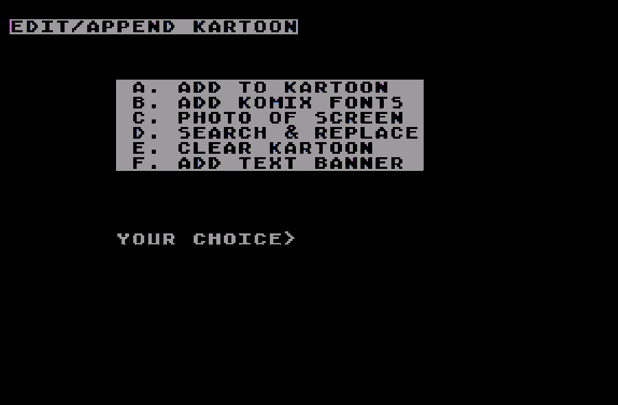

# komixkreater
Kevin Komix Kartoon Kreater, an animation/drawing program for ATASCII graphics. Written in Atari BASIC for Atari 8-bit computers, by me circa 1986-1987.

The biggest and best Atari program that I created in high school was Kevin Komix Kartoon Kreater (the spelling kills me! It should be Kreator, right?) a utility for making ATASCII art animation. So far I've only found various flavors of version 3, which was the last major update. It includes KFONT, a side utility for creating and displaying super-sized text. KFONT may be unfinished, I don't remember.

There are several versions of both programs on the ATR disk. I exported the final versions to ASCII text files for easier reading at github.
